# 钓鱼邮件服务器自动化部署使用说明

------

## **安装与部署**

服务器优先选择Debian12系统

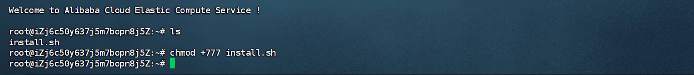直接将安装脚本丢到服务器，chmod添加运行权限直接运行。

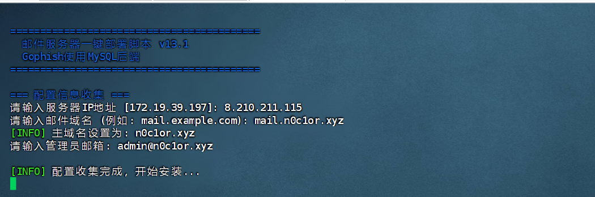按提示输入服务器的公网IP、邮件域名，输错了可以Ctrl+U重输。

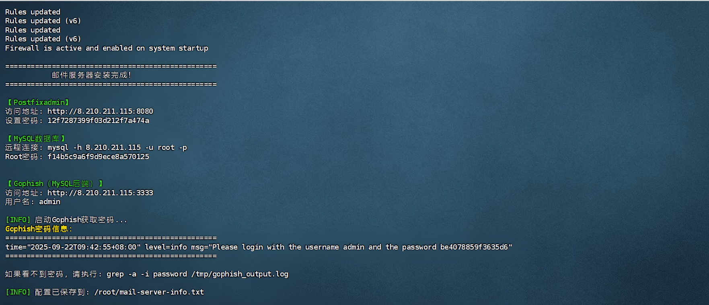没出现报错就是执行成功了

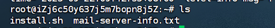
脚本执行完毕后会自动在当前目录备份密码配置信息，防止遗忘

## **Postfixadmin的使用**

### 管理员用户创建

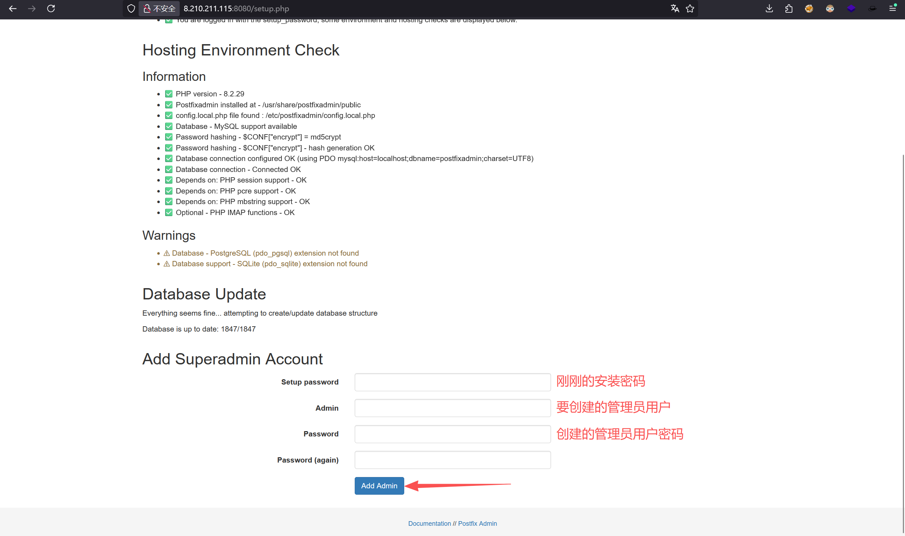访问/setup.php，在最下面添加超级管理员用户，用来管理系统

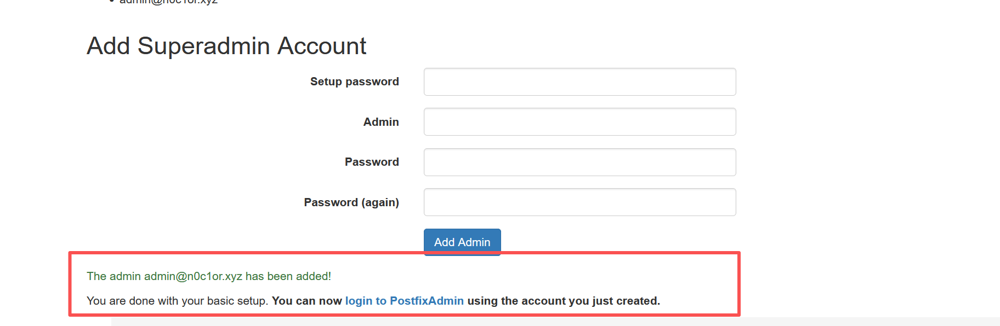出现绿字就是创建成功了，点击蓝字即可跳转至登录页

### 域名配置和发件用户创建

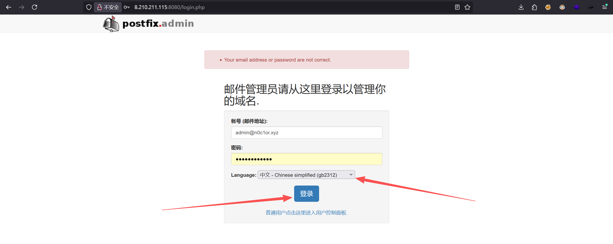输入创建的管理员用户密码，选择中文点击login

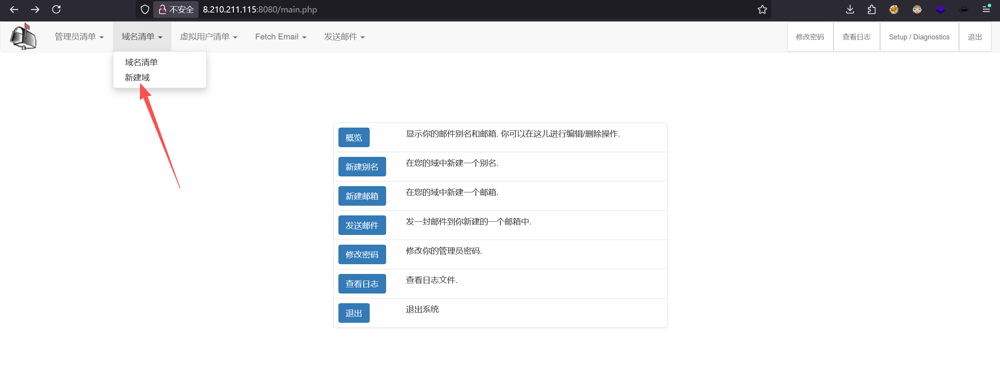登录系统后点击域名清单->新建域

这里就是配置我们的主域名，输入主域名后点击新增即可

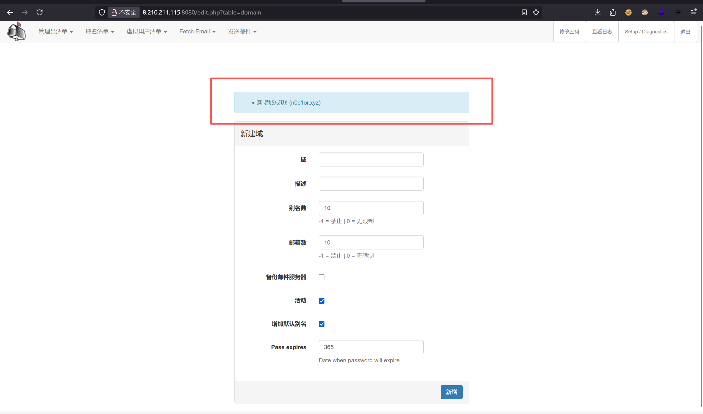出现提示新增成功

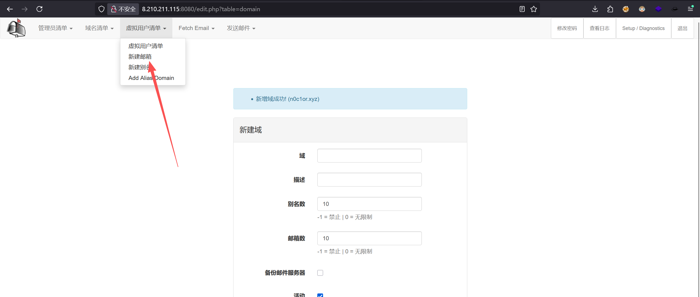点击虚拟用户清单->新建邮箱

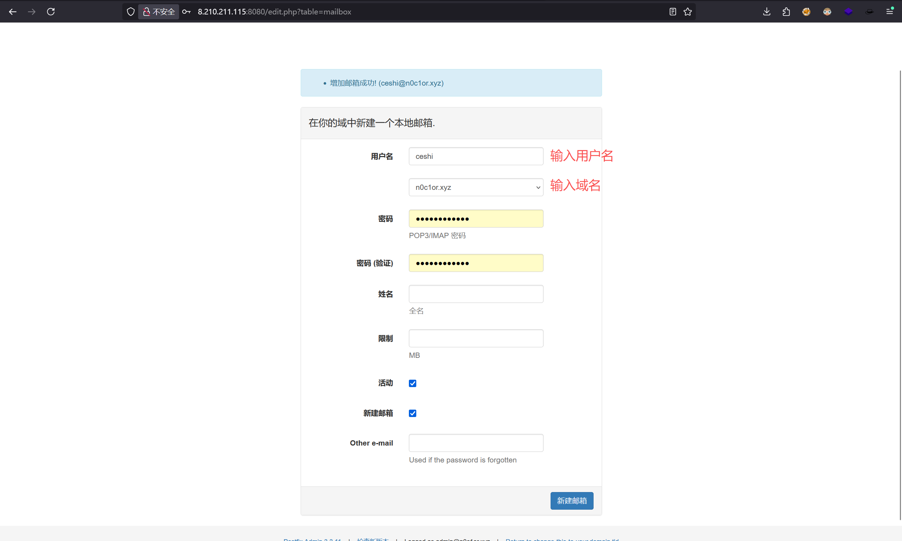从该位置创建发件人用户

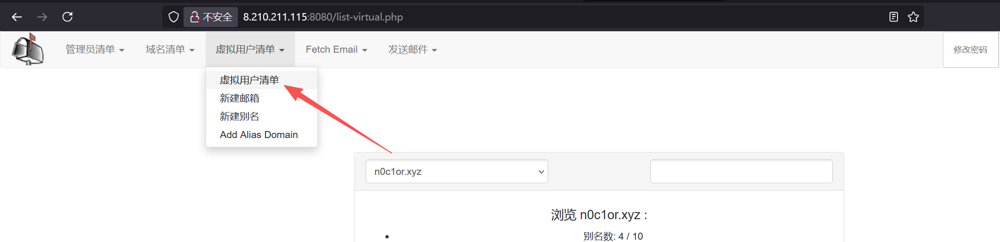点击虚拟用户清单->虚拟用户清单即可查看创建的邮箱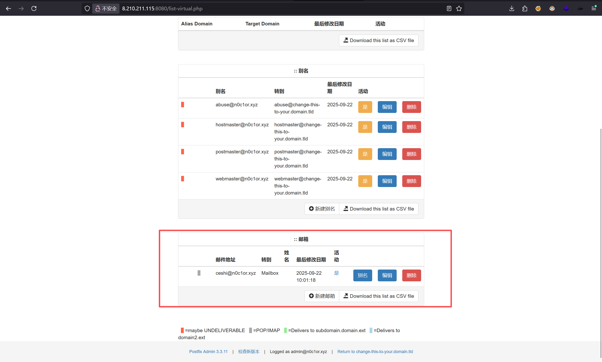

### 多域名绑定

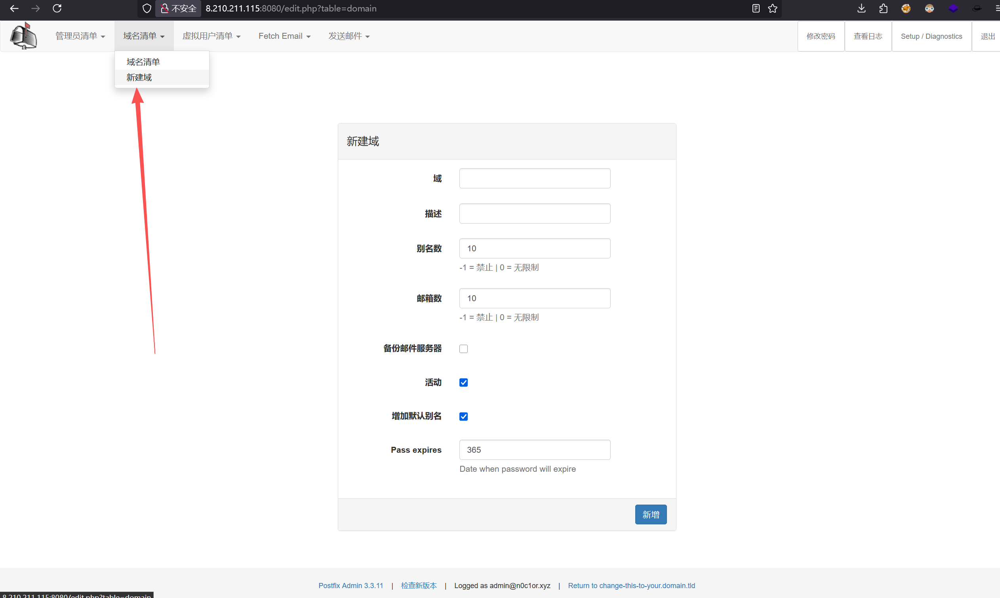可以通过新建域来绑定多个域名

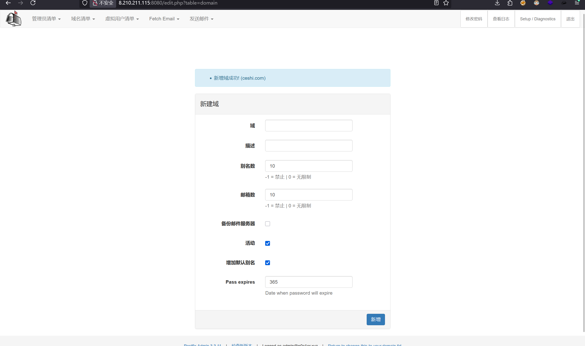这里举例创建一个ceshi.com的域名

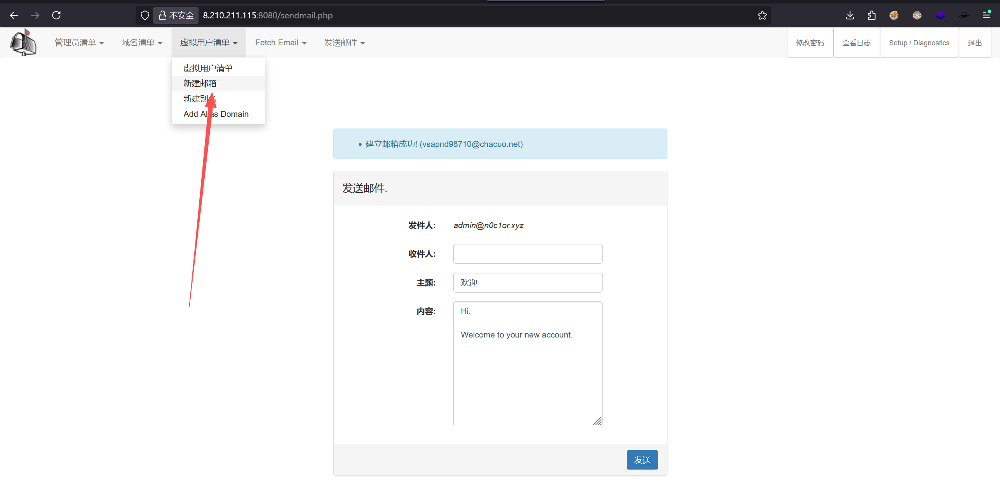点击虚拟用户清单->新建邮箱

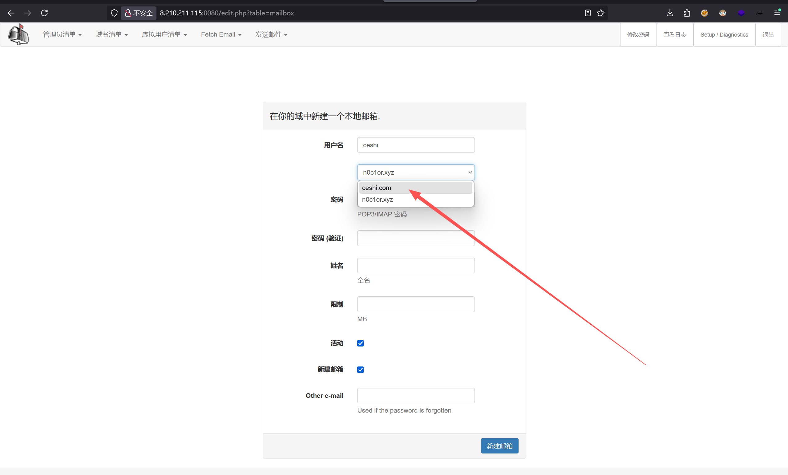通过选择不同的域来创建指定域的邮箱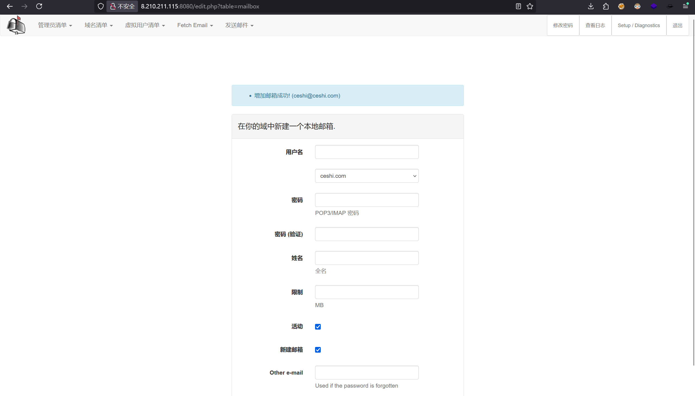

